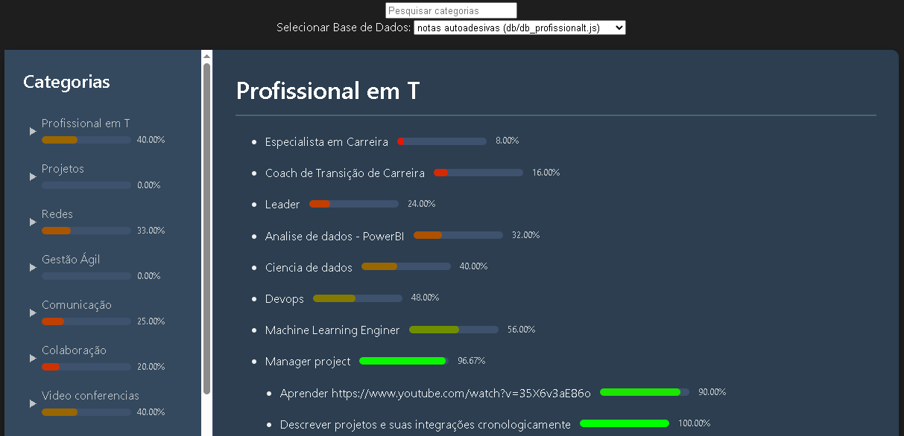

# StudyFlow: Seu Assistente de Estudos Tecnológicos em Tempos de Reflexão



## Descrição

Olá! Este é um protótipo que desenvolvi como uma ferramenta pessoal offline para me auxiliar nos estudos de tecnologia durante este período de reflexão e busca por uma nova oportunidade profissional. Em meio ao turbilhão de informações e avanços tecnológicos, especialmente com a ascensão da Inteligência Artificial, manter o foco e organizar o aprendizado se tornou um desafio ainda maior. O StudyFlow nasceu da necessidade de estruturar meu conhecimento e acompanhar meu progresso de forma visual e intuitiva.

O StudyFlow permite você organizar seu material de estudo por categorias e subníveis, permitindo uma visão clara da estrutura do seu aprendizado. Ele utiliza arquivos `.js` como base de dados, onde você define os tópicos de estudo, suas subdivisões e o nível de conclusão de cada item.

## Como Usar

1.  **Crie sua Base de Dados:**
    Crie um ou mais arquivos `.js` para armazenar seus dados de estudo. Cada arquivo deve conter um array de objetos com a seguinte estrutura:

    ```javascript
    const suaBaseDeDados = [
      {
        tarefa: "Conceitos Fundamentais",
        categoria: "JavaScript",
        concluida: "30" // Representa 30% de conclusão
      },
      {
        tarefa: "Manipulação do DOM > Seletores",
        categoria: "JavaScript",
        concluida: "75"
      },
      {
        tarefa: "Manipulação do DOM > Eventos > Adicionando Listeners",
        categoria: "JavaScript",
        concluida: "0"
      },
      {
        tarefa: "Sintaxe Básica",
        categoria: "Python",
        concluida: "90"
      },
      {
        tarefa: "Estruturas de Dados > Listas",
        categoria: "Python",
        concluida: "50"
      },
      {
        tarefa: "Introdução",
        categoria: "Redes",
        concluida: "100"
      },
      {
        tarefa: "Modelo OSI > Camada Física",
        categoria: "Redes",
        concluida: "60"
      }
      // ... adicione mais tópicos de estudo aqui
    ];
    ```

    * `tarefa`: O nome do tópico de estudo. Utilize o delimitador ` > ` para indicar subníveis (ex: "Tópico Principal > Subtópico 1 > Detalhe").
    * `categoria`: A categoria principal à qual o tópico pertence.
    * `concluida`: Um valor numérico (string ou número) representando a porcentagem de conclusão deste tópico (de 0 a 100).

2.  **Configure as Bases de Dados no HTML:**
    No seu arquivo cfg.js é o local que as bases de dados são configuradas (geralmente dentro de um array `databasesInfo`) onde já se encontra um exemplo "db_profissionalt" configurado. Adicione uma nova entrada para o seu arquivo `.js` criado seguindo a estrutura:

    ```javascript
    const databasesInfo = [
      { value: 'db_profissionalt', label: 'notas autoadesivas', src: 'db/db_profissionalt.js', dataVar: 'profissional_t', requiresConversion: false },
      { value: 'seu_id_unico', label: 'Nome da sua base', src: 'caminho/para/seu_arquivo.js', dataVar: 'nomeDaVariavelNoArquivo', requiresConversion: false }
      // Adicione mais configurações conforme necessário
    ];
    ```

    * `value`: Um identificador único para sua base de dados.
    * `label`: Um nome amigável para exibir no seletor de bases.
    * `src`: O caminho relativo para o seu arquivo `.js` contendo os dados.
    * `dataVar`: O nome da variável JavaScript dentro do seu arquivo `.js` que contém o array de dados (ex: `suaBaseDeDados`).
    * `requiresConversion`: Um valor booleano (`true` ou `false`). Se a estrutura dos seus dados for diferente da estrutura padrão, você precisará adaptar a função `converterParaListaDeTarefas` no código principal e definir este parâmetro como `true`.

3.  **Abra o HTML no seu Navegador:**
    Abra o arquivo HTML principal no seu navegador web. Você deverá ver a interface do StudyFlow carregando os dados da primeira base configurada.

4.  **Explore e Utilize:**
    * **Barra Lateral:** Navegue pelas categorias e subníveis de estudo. Clique na categoria para expandir/recolher os tópicos. A barra de progresso ao lado de cada item indica o nível de conclusão.
    * **Conteúdo Principal:** Ao selecionar um item na barra lateral, o título e o progresso detalhado serão exibidos no painel principal. Links presentes no texto da tarefa serão renderizados como links clicáveis.
    * **Seletor de Base de Dados:** Utilize o dropdown no topo para alternar entre as diferentes bases de dados configuradas.
    * **Pesquisa:** Use a barra de pesquisa para filtrar os itens na barra lateral, facilitando a localização de tópicos específicos.
    * **Impressão da Estrutura:** A funcionalidade de impressão da estrutura (geralmente acessível através de um botão ou no carregamento inicial) gera uma representação textual da organização dos seus estudos.

## Funcionalidades

* **Visualização Hierárquica:** Organização clara de categorias e subníveis de estudo.
* **Indicador de Progresso:** Acompanhamento visual do progresso em cada tópico.
* **Foco no Conteúdo:** Exibição detalhada do tópico selecionado com suporte a links.
* **Impressão da Estrutura:** Geração de uma representação textual da sua organização de estudos.
* **Pesquisa na Barra Lateral:** Filtragem rápida de tópicos na navegação.
* **Seleção Dinâmica de Base de Dados:** Flexibilidade para gerenciar múltiplos planos de estudo.


## Próximos Passos (Ideias)

Este é um protótipo em desenvolvimento, e futuras melhorias podem incluir:

* Edição direta da base de dados na interface.
* Persistência do progresso localmente.
* Integração com ferramentas de IA para auxiliar nos estudos.
* Visualizações de progresso mais avançadas (gráficos).

## Contribuição

Sinta-se à vontade para explorar o código, reportar problemas e sugerir melhorias! Este é um projeto pessoal com o objetivo de facilitar o aprendizado.

## Autor

[Fabiano Rocha/Fabiuniz]

## Licença

[MIT License]